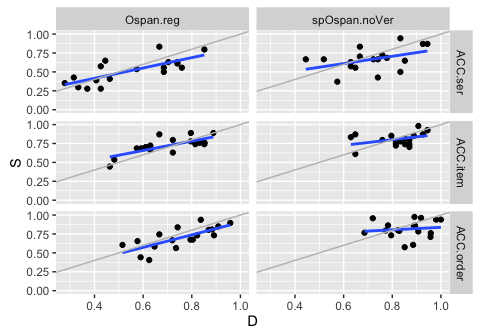
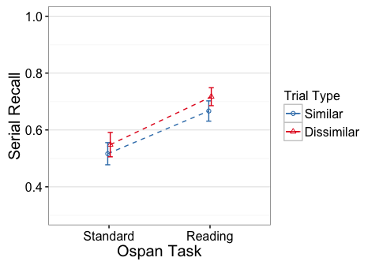
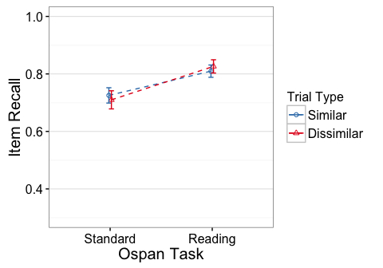

<!----
Template takes..
conds:  conditions to use (done using mustache syntax)
--->
e1 - Ospan.reg, spOspan.noVer
=============================

    library(knitr)
    opts_knit$set(self.contained=TRUE, root.dir="../")
    opts_chunk$set(fig.cap="", error=TRUE, cache=FALSE, echo=FALSE)#, fig.width=5, fig.height=3.5)

Descriptives
------------

#### N

    ##            task trialtype Participants
    ## 1     Ospan.reg         D           18
    ## 2     Ospan.reg         S           18
    ## 3 spOspan.noVer         D           18
    ## 4 spOspan.noVer         S           18

Residual Check
--------------

#### Scatterplots of Similar vs Dissimilar

gray line has intercept=0, slope=1. Blue line is regression fit.

#### Averaged across similarity conditions (and z-scored)

Effect Plots
------------

Standard errors are between group

ACC.ser
-------

    Error: Unique_ID
              Df Sum Sq Mean Sq F value  Pr(>F)   
    task       1 0.4577  0.4577   11.19 0.00202 **
    Residuals 34 1.3910  0.0409                   
    ---
    Signif. codes:  0 '***' 0.001 '**' 0.01 '*' 0.05 '.' 0.1 ' ' 1

    Error: Unique_ID:trialtype
                   Df Sum Sq  Mean Sq F value Pr(>F)  
    trialtype       1 0.0305 0.030483   3.156 0.0846 .
    task:trialtype  1 0.0015 0.001543   0.160 0.6919  
    Residuals      34 0.3284 0.009659                 
    ---
    Signif. codes:  0 '***' 0.001 '**' 0.01 '*' 0.05 '.' 0.1 ' ' 1

#### Partial Eta-square

                         eta.2
    task           0.247593627
    trialtype      0.084939215
    task:trialtype 0.004677214

#### Simple Effects

#### Standard

    Error: Unique_ID
              Df Sum Sq Mean Sq F value Pr(>F)
    Residuals 17 0.8951 0.05266               

    Error: Unique_ID:trialtype
              Df  Sum Sq  Mean Sq F value Pr(>F)
    trialtype  1 0.00915 0.009154   1.208  0.287
    Residuals 17 0.12888 0.007581               

                  eta.2
    trialtype 0.0663216

#### Reading

    Error: Unique_ID
              Df Sum Sq Mean Sq F value Pr(>F)
    Residuals 17 0.4958 0.02917               

    Error: Unique_ID:trialtype
              Df  Sum Sq Mean Sq F value Pr(>F)
    trialtype  1 0.02287 0.02287   1.949  0.181
    Residuals 17 0.19952 0.01174               

                  eta.2
    trialtype 0.1028442

ACC.item
--------

    Error: Unique_ID
              Df Sum Sq Mean Sq F value Pr(>F)   
    task       1 0.1811 0.18111   9.307 0.0044 **
    Residuals 34 0.6616 0.01946                  
    ---
    Signif. codes:  0 '***' 0.001 '**' 0.01 '*' 0.05 '.' 0.1 ' ' 1

    Error: Unique_ID:trialtype
                   Df  Sum Sq  Mean Sq F value Pr(>F)
    trialtype       1 0.00000 0.000005   0.001  0.975
    task:trialtype  1 0.00458 0.004577   0.959  0.334
    Residuals      34 0.16226 0.004772               

#### Partial Eta-square

                          eta.2
    task           2.149143e-01
    trialtype      2.935392e-05
    task:trialtype 2.743598e-02

#### Simple Effects

#### Standard

    Error: Unique_ID
              Df Sum Sq Mean Sq F value Pr(>F)
    Residuals 17  0.449 0.02641               

    Error: Unique_ID:trialtype
              Df  Sum Sq  Mean Sq F value Pr(>F)
    trialtype  1 0.00214 0.002143   0.508  0.486
    Residuals 17 0.07176 0.004221               

                   eta.2
    trialtype 0.02900232

#### Reading

    Error: Unique_ID
              Df Sum Sq Mean Sq F value Pr(>F)
    Residuals 17 0.2126 0.01251               

    Error: Unique_ID:trialtype
              Df  Sum Sq  Mean Sq F value Pr(>F)
    trialtype  1 0.00244 0.002439   0.458  0.508
    Residuals 17 0.09050 0.005323               

                   eta.2
    trialtype 0.02624026

ACC.order
---------

    Error: Unique_ID
              Df Sum Sq Mean Sq F value  Pr(>F)   
    task       1 0.2237 0.22367   9.979 0.00332 **
    Residuals 34 0.7621 0.02241                   
    ---
    Signif. codes:  0 '***' 0.001 '**' 0.01 '*' 0.05 '.' 0.1 ' ' 1

    Error: Unique_ID:trialtype
                   Df  Sum Sq Mean Sq F value Pr(>F)  
    trialtype       1 0.04709 0.04709   6.461 0.0158 *
    task:trialtype  1 0.00016 0.00016   0.022 0.8834  
    Residuals      34 0.24784 0.00729                 
    ---
    Signif. codes:  0 '***' 0.001 '**' 0.01 '*' 0.05 '.' 0.1 ' ' 1

#### Partial Eta-square

                          eta.2
    task           0.2268971886
    trialtype      0.1596748491
    task:trialtype 0.0006421457

#### Simple Effects

#### Standard

    Error: Unique_ID
              Df Sum Sq Mean Sq F value Pr(>F)
    Residuals 17 0.5582 0.03283               

    Error: Unique_ID:trialtype
              Df  Sum Sq  Mean Sq F value Pr(>F)  
    trialtype  1 0.02636 0.026365   5.112 0.0372 *
    Residuals 17 0.08768 0.005157                 
    ---
    Signif. codes:  0 '***' 0.001 '**' 0.01 '*' 0.05 '.' 0.1 ' ' 1

                  eta.2
    trialtype 0.2311856

#### Reading

    Error: Unique_ID
              Df Sum Sq Mean Sq F value Pr(>F)
    Residuals 17  0.204   0.012               

    Error: Unique_ID:trialtype
              Df  Sum Sq  Mean Sq F value Pr(>F)
    trialtype  1 0.02089 0.020888   2.217  0.155
    Residuals 17 0.16016 0.009421               

                eta.2
    trialtype 0.11537
