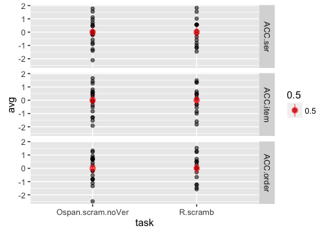

<!----
Template takes..
conds:  conditions to use (done using mustache syntax)
--->
e2 - R.scramb, Ospan.scram.noVer
================================

    library(knitr)
    opts_knit$set(self.contained=TRUE, root.dir="../")
    opts_chunk$set(fig.cap="", error=TRUE, cache=FALSE, echo=FALSE)#, fig.width=5, fig.height=3.5)

Descriptives
------------

#### N

    ##                task trialtype Participants
    ## 1 Ospan.scram.noVer         D           20
    ## 2 Ospan.scram.noVer         S           20
    ## 3          R.scramb         D           16
    ## 4          R.scramb         S           16

Residual Check
--------------

#### Scatterplots of Similar vs Dissimilar

gray line has intercept=0, slope=1. Blue line is regression fit.

#### Averaged across similarity conditions (and z-scored)

Effect Plots
------------

Standard errors are between group

ACC.ser
-------

    Error: Unique_ID
              Df Sum Sq Mean Sq F value Pr(>F)  
    task       1 0.4043  0.4043   7.373 0.0103 *
    Residuals 34 1.8646  0.0548                 
    ---
    Signif. codes:  0 '***' 0.001 '**' 0.01 '*' 0.05 '.' 0.1 ' ' 1

    Error: Unique_ID:trialtype
                   Df  Sum Sq Mean Sq F value Pr(>F)  
    trialtype       1 0.02679 0.02679   3.207 0.0822 .
    task:trialtype  1 0.05556 0.05556   6.649 0.0144 *
    Residuals      34 0.28408 0.00836                 
    ---
    Signif. codes:  0 '***' 0.001 '**' 0.01 '*' 0.05 '.' 0.1 ' ' 1

#### Partial Eta-square

                        eta.2
    task           0.17820538
    trialtype      0.08618372
    task:trialtype 0.16358071

#### Simple Effects

#### Ospan

    Error: Unique_ID
              Df Sum Sq Mean Sq F value Pr(>F)
    Residuals 19  1.088 0.05726               

    Error: Unique_ID:trialtype
              Df  Sum Sq  Mean Sq F value Pr(>F)
    trialtype  1 0.00123 0.001235   0.157  0.697
    Residuals 19 0.14966 0.007877               

                    eta.2
    trialtype 0.008181818

#### Rspan

    Error: Unique_ID
              Df Sum Sq Mean Sq F value Pr(>F)
    Residuals 15 0.7767 0.05178               

    Error: Unique_ID:trialtype
              Df  Sum Sq Mean Sq F value  Pr(>F)   
    trialtype  1 0.08111 0.08111   9.052 0.00882 **
    Residuals 15 0.13442 0.00896                   
    ---
    Signif. codes:  0 '***' 0.001 '**' 0.01 '*' 0.05 '.' 0.1 ' ' 1

                  eta.2
    trialtype 0.3763425

ACC.item
--------

    Error: Unique_ID
              Df Sum Sq Mean Sq F value  Pr(>F)   
    task       1 0.2362 0.23625   8.089 0.00749 **
    Residuals 34 0.9930 0.02921                   
    ---
    Signif. codes:  0 '***' 0.001 '**' 0.01 '*' 0.05 '.' 0.1 ' ' 1

    Error: Unique_ID:trialtype
                   Df  Sum Sq Mean Sq F value   Pr(>F)    
    trialtype       1 0.10433 0.10433   22.84 3.32e-05 ***
    task:trialtype  1 0.06097 0.06097   13.35 0.000864 ***
    Residuals      34 0.15534 0.00457                     
    ---
    Signif. codes:  0 '***' 0.001 '**' 0.01 '*' 0.05 '.' 0.1 ' ' 1

#### Partial Eta-square

                       eta.2
    task           0.1921886
    trialtype      0.4017741
    task:trialtype 0.2818786

#### Simple Effects

#### Ospan

    Error: Unique_ID
              Df Sum Sq Mean Sq F value Pr(>F)
    Residuals 19 0.5391 0.02838               

    Error: Unique_ID:trialtype
              Df  Sum Sq  Mean Sq F value Pr(>F)
    trialtype  1 0.00580 0.005796   1.198  0.287
    Residuals 19 0.09194 0.004839               

                   eta.2
    trialtype 0.05929825

#### Rspan

    Error: Unique_ID
              Df Sum Sq Mean Sq F value Pr(>F)
    Residuals 15 0.4539 0.03026               

    Error: Unique_ID:trialtype
              Df Sum Sq Mean Sq F value   Pr(>F)    
    trialtype  1 0.1595 0.15951   37.74 1.88e-05 ***
    Residuals 15 0.0634 0.00423                     
    ---
    Signif. codes:  0 '***' 0.001 '**' 0.01 '*' 0.05 '.' 0.1 ' ' 1

                  eta.2
    trialtype 0.7155769

ACC.order
---------

    Error: Unique_ID
              Df Sum Sq Mean Sq F value Pr(>F)  
    task       1 0.1076  0.1076   4.219 0.0477 *
    Residuals 34 0.8672  0.0255                 
    ---
    Signif. codes:  0 '***' 0.001 '**' 0.01 '*' 0.05 '.' 0.1 ' ' 1

    Error: Unique_ID:trialtype
                   Df  Sum Sq  Mean Sq F value Pr(>F)  
    trialtype       1 0.01939 0.019393   2.910 0.0972 .
    task:trialtype  1 0.00251 0.002511   0.377 0.5435  
    Residuals      34 0.22661 0.006665                 
    ---
    Signif. codes:  0 '***' 0.001 '**' 0.01 '*' 0.05 '.' 0.1 ' ' 1

#### Partial Eta-square

                        eta.2
    task           0.11038386
    trialtype      0.07883231
    task:trialtype 0.01095812

#### Simple Effects

#### Ospan

    Error: Unique_ID
              Df Sum Sq Mean Sq F value Pr(>F)
    Residuals 19 0.4382 0.02306               

    Error: Unique_ID:trialtype
              Df  Sum Sq  Mean Sq F value Pr(>F)
    trialtype  1 0.01882 0.018825   2.831  0.109
    Residuals 19 0.12633 0.006649               

                  eta.2
    trialtype 0.1296882

#### Rspan

    Error: Unique_ID
              Df Sum Sq Mean Sq F value Pr(>F)
    Residuals 15  0.429  0.0286               

    Error: Unique_ID:trialtype
              Df  Sum Sq  Mean Sq F value Pr(>F)
    trialtype  1 0.00308 0.003079   0.461  0.508
    Residuals 15 0.10029 0.006686               

                   eta.2
    trialtype 0.02979128
