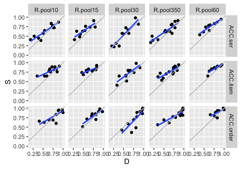
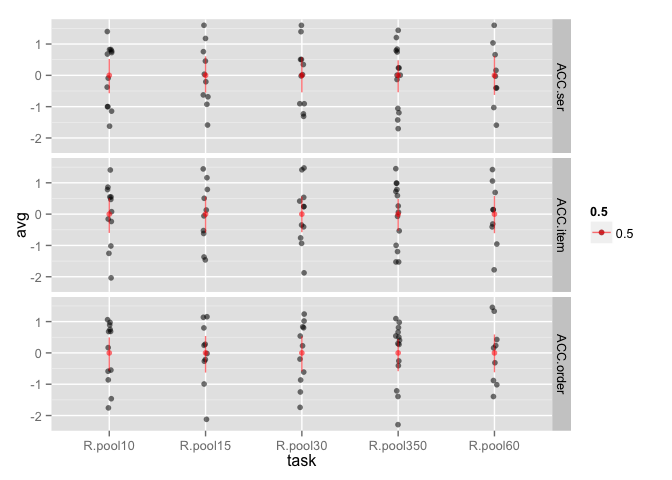
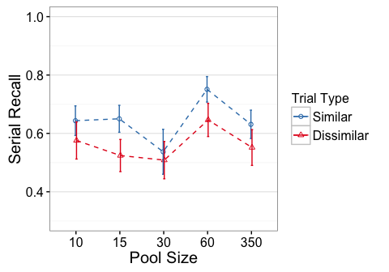
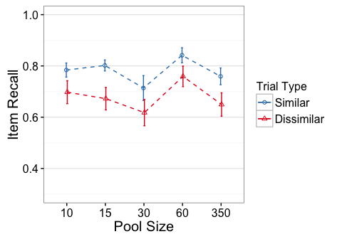
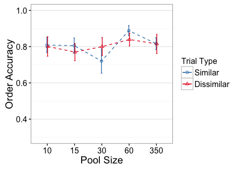

<!----
Template takes..
conds:  conditions to use (done using mustache syntax)
--->
e3 - R.pool10, R.pool15, R.pool30, R.pool60, R.pool350
======================================================

    library(knitr)
    opts_knit$set(self.contained=TRUE, root.dir="../")
    opts_chunk$set(fig.cap="", error=TRUE, cache=FALSE, echo=FALSE)#, fig.width=5, fig.height=3.5)

Descriptives
------------

#### N

    ##         task trialtype Participants
    ## 1   R.pool10         D           12
    ## 2   R.pool10         S           12
    ## 3   R.pool15         D           10
    ## 4   R.pool15         S           10
    ## 5   R.pool30         D           11
    ## 6   R.pool30         S           11
    ## 7  R.pool350         D           14
    ## 8  R.pool350         S           14
    ## 9   R.pool60         D            9
    ## 10  R.pool60         S            9

Residual Check
--------------

#### Scatterplots of Similar vs Dissimilar

gray line has intercept=0, slope=1. Blue line is regression fit.

#### Averaged across similarity conditions (and z-scored)

Effect Plots
------------

Standard errors are between group

ACC.ser
-------

    Error: Unique_ID
              Df Sum Sq Mean Sq F value Pr(>F)
    task       4  0.314 0.07839   1.082  0.375
    Residuals 51  3.695 0.07246               

    Error: Unique_ID:trialtype
                   Df  Sum Sq Mean Sq F value   Pr(>F)    
    trialtype       1 0.17637 0.17637  38.804 8.95e-08 ***
    task:trialtype  4 0.02873 0.00718   1.581    0.194    
    Residuals      51 0.23180 0.00455                     
    ---
    Signif. codes:  0 '***' 0.001 '**' 0.01 '*' 0.05 '.' 0.1 ' ' 1

#### Partial Eta-square

                        eta.2
    task           0.07821544
    trialtype      0.43209616
    task:trialtype 0.11028981

#### Simple Effects

#### 10

    Error: Unique_ID
              Df Sum Sq Mean Sq F value Pr(>F)
    Residuals 11 0.8192 0.07447               

    Error: Unique_ID:trialtype
              Df  Sum Sq  Mean Sq F value Pr(>F)  
    trialtype  1 0.02766 0.027663   5.676 0.0363 *
    Residuals 11 0.05361 0.004874                 
    ---
    Signif. codes:  0 '***' 0.001 '**' 0.01 '*' 0.05 '.' 0.1 ' ' 1

                  eta.2
    trialtype 0.3403657

#### 15

    Error: Unique_ID
              Df Sum Sq Mean Sq F value Pr(>F)
    Residuals  9 0.4274 0.04749               

    Error: Unique_ID:trialtype
              Df  Sum Sq Mean Sq F value  Pr(>F)   
    trialtype  1 0.07929 0.07929   19.12 0.00179 **
    Residuals  9 0.03731 0.00415                   
    ---
    Signif. codes:  0 '***' 0.001 '**' 0.01 '*' 0.05 '.' 0.1 ' ' 1

              eta.2
    trialtype  0.68

#### 30

    Error: Unique_ID
              Df Sum Sq Mean Sq F value Pr(>F)
    Residuals 10  1.052  0.1052               

    Error: Unique_ID:trialtype
              Df  Sum Sq  Mean Sq F value Pr(>F)
    trialtype  1 0.00450 0.004505   0.879   0.37
    Residuals 10 0.05122 0.005122               

                   eta.2
    trialtype 0.08083916

#### 60

    Error: Unique_ID
              Df Sum Sq Mean Sq F value Pr(>F)
    Residuals  8 0.3509 0.04386               

    Error: Unique_ID:trialtype
              Df  Sum Sq Mean Sq F value  Pr(>F)   
    trialtype  1 0.04955 0.04955   20.64 0.00189 **
    Residuals  8 0.01920 0.00240                   
    ---
    Signif. codes:  0 '***' 0.001 '**' 0.01 '*' 0.05 '.' 0.1 ' ' 1

                  eta.2
    trialtype 0.7206983

#### 350

    Error: Unique_ID
              Df Sum Sq Mean Sq F value Pr(>F)
    Residuals 13  1.046 0.08045               

    Error: Unique_ID:trialtype
              Df  Sum Sq Mean Sq F value Pr(>F)  
    trialtype  1 0.04409 0.04409   8.136 0.0136 *
    Residuals 13 0.07045 0.00542                 
    ---
    Signif. codes:  0 '***' 0.001 '**' 0.01 '*' 0.05 '.' 0.1 ' ' 1

                  eta.2
    trialtype 0.3849444

ACC.item
--------

    Error: Unique_ID
              Df Sum Sq Mean Sq F value Pr(>F)
    task       4 0.2001 0.05002   1.543  0.204
    Residuals 51 1.6530 0.03241               

    Error: Unique_ID:trialtype
                   Df  Sum Sq Mean Sq F value  Pr(>F)    
    trialtype       1 0.28671 0.28671  66.859 7.7e-11 ***
    task:trialtype  4 0.00763 0.00191   0.445   0.776    
    Residuals      51 0.21870 0.00429                    
    ---
    Signif. codes:  0 '***' 0.001 '**' 0.01 '*' 0.05 '.' 0.1 ' ' 1

#### Partial Eta-square

                        eta.2
    task           0.10797249
    trialtype      0.56727976
    task:trialtype 0.03369481

#### Simple Effects

#### 10

    Error: Unique_ID
              Df Sum Sq Mean Sq F value Pr(>F)
    Residuals 11 0.3076 0.02797               

    Error: Unique_ID:trialtype
              Df  Sum Sq Mean Sq F value Pr(>F)  
    trialtype  1 0.04481 0.04481   8.965 0.0122 *
    Residuals 11 0.05498 0.00500                 
    ---
    Signif. codes:  0 '***' 0.001 '**' 0.01 '*' 0.05 '.' 0.1 ' ' 1

                  eta.2
    trialtype 0.4490263

#### 15

    Error: Unique_ID
              Df Sum Sq Mean Sq F value Pr(>F)
    Residuals  9 0.1757 0.01952               

    Error: Unique_ID:trialtype
              Df  Sum Sq Mean Sq F value  Pr(>F)   
    trialtype  1 0.08402 0.08402   19.34 0.00173 **
    Residuals  9 0.03909 0.00434                   
    ---
    Signif. codes:  0 '***' 0.001 '**' 0.01 '*' 0.05 '.' 0.1 ' ' 1

                  eta.2
    trialtype 0.6824513

#### 30

    Error: Unique_ID
              Df Sum Sq Mean Sq F value Pr(>F)
    Residuals 10 0.4967 0.04967               

    Error: Unique_ID:trialtype
              Df  Sum Sq Mean Sq F value  Pr(>F)   
    trialtype  1 0.05065 0.05065   10.34 0.00924 **
    Residuals 10 0.04898 0.00490                   
    ---
    Signif. codes:  0 '***' 0.001 '**' 0.01 '*' 0.05 '.' 0.1 ' ' 1

                  eta.2
    trialtype 0.5083711

#### 60

    Error: Unique_ID
              Df Sum Sq Mean Sq F value Pr(>F)
    Residuals  8  0.164 0.02049               

    Error: Unique_ID:trialtype
              Df  Sum Sq  Mean Sq F value  Pr(>F)   
    trialtype  1 0.03048 0.030483   18.66 0.00255 **
    Residuals  8 0.01307 0.001634                   
    ---
    Signif. codes:  0 '***' 0.001 '**' 0.01 '*' 0.05 '.' 0.1 ' ' 1

                  eta.2
    trialtype 0.6999125

#### 350

    Error: Unique_ID
              Df Sum Sq Mean Sq F value Pr(>F)
    Residuals 13 0.5091 0.03916               

    Error: Unique_ID:trialtype
              Df  Sum Sq Mean Sq F value  Pr(>F)   
    trialtype  1 0.08437 0.08437   17.53 0.00107 **
    Residuals 13 0.06257 0.00481                   
    ---
    Signif. codes:  0 '***' 0.001 '**' 0.01 '*' 0.05 '.' 0.1 ' ' 1

                 eta.2
    trialtype 0.574179

ACC.order
---------

    Error: Unique_ID
              Df Sum Sq Mean Sq F value Pr(>F)
    task       4 0.1152 0.02880   0.635   0.64
    Residuals 51 2.3130 0.04535               

    Error: Unique_ID:trialtype
                   Df  Sum Sq  Mean Sq F value Pr(>F)  
    trialtype       1 0.00001 0.000008   0.001 0.9705  
    task:trialtype  4 0.05232 0.013081   2.376 0.0642 .
    Residuals      51 0.28082 0.005506                 
    ---
    Signif. codes:  0 '***' 0.001 '**' 0.01 '*' 0.05 '.' 0.1 ' ' 1

#### Partial Eta-square

                          eta.2
    task           4.743673e-02
    trialtype      2.714524e-05
    task:trialtype 1.570576e-01

#### Simple Effects

#### 10

    Error: Unique_ID
              Df Sum Sq Mean Sq F value Pr(>F)
    Residuals 11 0.5309 0.04826               

    Error: Unique_ID:trialtype
              Df  Sum Sq  Mean Sq F value Pr(>F)
    trialtype  1 0.00032 0.000324   0.046  0.833
    Residuals 11 0.07673 0.006975               

                   eta.2
    trialtype 0.00420218

#### 15

    Error: Unique_ID
              Df Sum Sq Mean Sq F value Pr(>F)
    Residuals  9 0.3363 0.03737               

    Error: Unique_ID:trialtype
              Df   Sum Sq  Mean Sq F value Pr(>F)
    trialtype  1 0.006323 0.006323   2.108   0.18
    Residuals  9 0.026991 0.002999               

                  eta.2
    trialtype 0.1898084

#### 30

    Error: Unique_ID
              Df Sum Sq Mean Sq F value Pr(>F)
    Residuals 10 0.6779 0.06779               

    Error: Unique_ID:trialtype
              Df  Sum Sq Mean Sq F value Pr(>F)  
    trialtype  1 0.03488 0.03488   4.027 0.0726 .
    Residuals 10 0.08661 0.00866                 
    ---
    Signif. codes:  0 '***' 0.001 '**' 0.01 '*' 0.05 '.' 0.1 ' ' 1

                  eta.2
    trialtype 0.2871028

#### 60

    Error: Unique_ID
              Df Sum Sq Mean Sq F value Pr(>F)
    Residuals  8 0.1212 0.01515               

    Error: Unique_ID:trialtype
              Df  Sum Sq  Mean Sq F value Pr(>F)
    trialtype  1 0.01079 0.010787   3.453    0.1
    Residuals  8 0.02499 0.003124               

                  eta.2
    trialtype 0.3014766

#### 350

    Error: Unique_ID
              Df Sum Sq Mean Sq F value Pr(>F)
    Residuals 13 0.6467 0.04975               

    Error: Unique_ID:trialtype
              Df  Sum Sq  Mean Sq F value Pr(>F)
    trialtype  1 0.00002 0.000015   0.003  0.957
    Residuals 13 0.06550 0.005038               

                    eta.2
    trialtype 0.000236175
