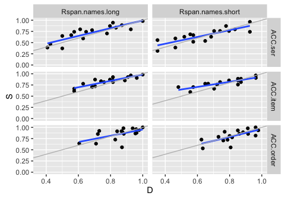
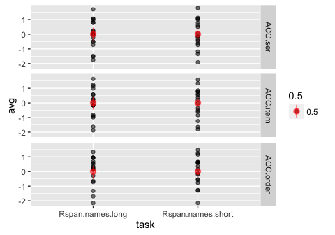
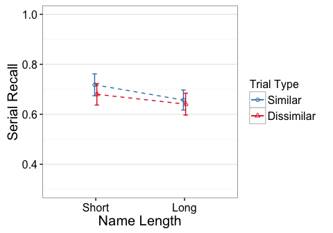
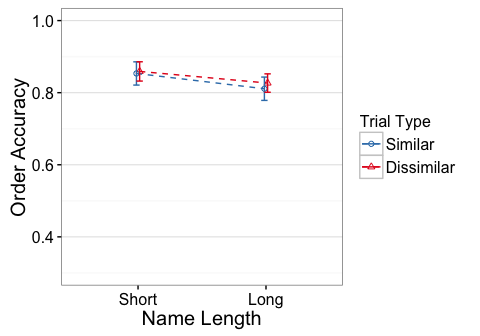

<!----
Template takes..
conds:  conditions to use (done using mustache syntax)
--->
e4 - Rspan.names.long, Rspan.names.short
========================================

    library(knitr)
    opts_knit$set(self.contained=TRUE, root.dir="../")
    opts_chunk$set(fig.cap="", error=TRUE, cache=FALSE, echo=FALSE)#, fig.width=5, fig.height=3.5)

Descriptives
------------

#### N

    ##                task trialtype Participants
    ## 1  Rspan.names.long         D           17
    ## 2  Rspan.names.long         S           17
    ## 3 Rspan.names.short         D           17
    ## 4 Rspan.names.short         S           17

Residual Check
--------------

#### Scatterplots of Similar vs Dissimilar

gray line has intercept=0, slope=1. Blue line is regression fit.

#### Averaged across similarity conditions (and z-scored)

Effect Plots
------------

Standard errors are between group

ACC.ser
-------

    Error: Unique_ID
              Df Sum Sq Mean Sq F value Pr(>F)
    task       1 0.0427 0.04269   0.751  0.393
    Residuals 32 1.8191 0.05685               

    Error: Unique_ID:trialtype
                   Df  Sum Sq  Mean Sq F value Pr(>F)
    trialtype       1 0.01261 0.012608   2.512  0.123
    task:trialtype  1 0.00202 0.002017   0.402  0.531
    Residuals      32 0.16061 0.005019               

#### Partial Eta-square

                        eta.2
    task           0.02292673
    trialtype      0.07278444
    task:trialtype 0.01240387

#### Simple Effects

#### Short

    Error: Unique_ID
              Df Sum Sq Mean Sq F value Pr(>F)
    Residuals 16 0.9465 0.05916               

    Error: Unique_ID:trialtype
              Df  Sum Sq  Mean Sq F value Pr(>F)
    trialtype  1 0.01236 0.012356   2.568  0.129
    Residuals 16 0.07698 0.004811               

                  eta.2
    trialtype 0.1383087

#### Long

    Error: Unique_ID
              Df Sum Sq Mean Sq F value Pr(>F)
    Residuals 16 0.8726 0.05454               

    Error: Unique_ID:trialtype
              Df  Sum Sq  Mean Sq F value Pr(>F)
    trialtype  1 0.00227 0.002269   0.434  0.519
    Residuals 16 0.08364 0.005227               

                   eta.2
    trialtype 0.02641775

ACC.item
--------

    Error: Unique_ID
              Df Sum Sq  Mean Sq F value Pr(>F)
    task       1 0.0098 0.009764   0.376  0.544
    Residuals 32 0.8320 0.025999               

    Error: Unique_ID:trialtype
                   Df  Sum Sq  Mean Sq F value  Pr(>F)   
    trialtype       1 0.02913 0.029129  11.440 0.00191 **
    task:trialtype  1 0.00050 0.000504   0.198 0.65928   
    Residuals      32 0.08148 0.002546                   
    ---
    Signif. codes:  0 '***' 0.001 '**' 0.01 '*' 0.05 '.' 0.1 ' ' 1

#### Partial Eta-square

                         eta.2
    task           0.011599204
    trialtype      0.263359475
    task:trialtype 0.006151575

#### Simple Effects

#### Short

    Error: Unique_ID
              Df Sum Sq Mean Sq F value Pr(>F)
    Residuals 16 0.4095 0.02559               

    Error: Unique_ID:trialtype
              Df  Sum Sq  Mean Sq F value Pr(>F)   
    trialtype  1 0.01865 0.018650   9.874 0.0063 **
    Residuals 16 0.03022 0.001889                  
    ---
    Signif. codes:  0 '***' 0.001 '**' 0.01 '*' 0.05 '.' 0.1 ' ' 1

                  eta.2
    trialtype 0.3816305

#### Long

    Error: Unique_ID
              Df Sum Sq Mean Sq F value Pr(>F)
    Residuals 16 0.4225 0.02641               

    Error: Unique_ID:trialtype
              Df  Sum Sq  Mean Sq F value Pr(>F)  
    trialtype  1 0.01098 0.010984   3.429 0.0826 .
    Residuals 16 0.05126 0.003204                 
    ---
    Signif. codes:  0 '***' 0.001 '**' 0.01 '*' 0.05 '.' 0.1 ' ' 1

                  eta.2
    trialtype 0.1764706

ACC.order
---------

    Error: Unique_ID
              Df Sum Sq Mean Sq F value Pr(>F)
    task       1 0.0237  0.0237   0.996  0.326
    Residuals 32 0.7617  0.0238               

    Error: Unique_ID:trialtype
                   Df  Sum Sq  Mean Sq F value Pr(>F)
    trialtype       1 0.00195 0.001949   0.350  0.558
    task:trialtype  1 0.00044 0.000435   0.078  0.782
    Residuals      32 0.17806 0.005564               

#### Partial Eta-square

                         eta.2
    task           0.030171349
    trialtype      0.010829901
    task:trialtype 0.002437748

#### Simple Effects

#### Short

    Error: Unique_ID
              Df Sum Sq Mean Sq F value Pr(>F)
    Residuals 16 0.3746 0.02341               

    Error: Unique_ID:trialtype
              Df  Sum Sq  Mean Sq F value Pr(>F)
    trialtype  1 0.00027 0.000271   0.042   0.84
    Residuals 16 0.10313 0.006445               

                    eta.2
    trialtype 0.002623665

#### Long

    Error: Unique_ID
              Df Sum Sq Mean Sq F value Pr(>F)
    Residuals 16 0.3871  0.0242               

    Error: Unique_ID:trialtype
              Df  Sum Sq  Mean Sq F value Pr(>F)
    trialtype  1 0.00211 0.002113   0.451  0.511
    Residuals 16 0.07493 0.004683               

                   eta.2
    trialtype 0.02743009
