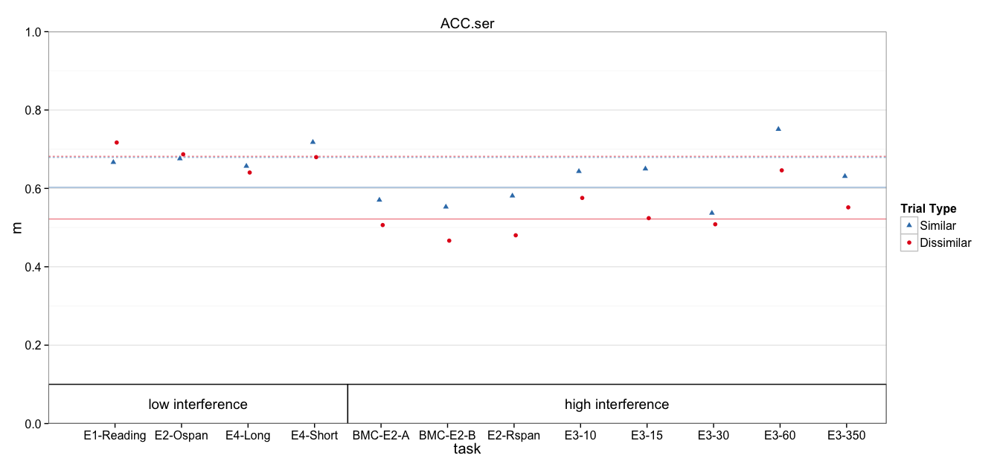

# Multilevel model of accuracy


```r
debug = FALSE
library(knitr)
opts_chunk$set(comment='', fig.width=14, fig.height=6.5)
opts_knit$set(self.contained=TRUE)
```

```
Loading required package: Matrix

Attaching package: 'Matrix'

The following object is masked from 'package:reshape':

    expand

Loading required package: Rcpp
```

Read in data


```r
DV_VAR = params$dv_var

all.dat = read.csv('data/1_scored.csv')
all.dat$Subject = factor(all.dat$Subject)
all.dat$dv = all.dat[,DV_VAR]

# Omit task, because Brooke thought effects were originally in other direction
# it's not clear if the data were preprocessed incorrectly (and raw data is
# not available)
dat = subset(all.dat, !task %in% 'Ospan.reg')

# Mark high and low interference conditions
low_int = c('spOspan.noVer', 'Ospan.scram.noVer', 'Rspan.names.long', 'Rspan.names.short', 'Ospan.reg')
dat$interference = ifelse(dat$task %in% low_int, 'low', 'high')
```

Models
----------------------------------------------------------------------------


```r
dat$cond = paste(dat$interference, dat$trialtype)
contrasts(dat$trialtype) <- c(0,1)                # similarity increment
```

### Model with recall predictions for each interference:trialtype explicit


```r
fit.mlm = lmer(dv ~ 0 + cond + (1 | task:Subject) + (1 | task), data=dat)
summary(fit.mlm)
```

```
Linear mixed model fit by REML ['lmerMod']
Formula: dv ~ 0 + cond + (1 | task:Subject) + (1 | task)
   Data: dat

REML criterion at convergence: -382.4

Scaled residuals: 
     Min       1Q   Median       3Q      Max 
-2.03890 -0.51960 -0.00493  0.52105  2.07599 

Random effects:
 Groups       Name        Variance  Std.Dev.
 task:Subject (Intercept) 2.435e-02 0.156030
 task         (Intercept) 4.146e-05 0.006439
 Residual                 6.832e-03 0.082654
Number of obs: 368, groups:  task:Subject, 184; task, 12

Fixed effects:
           Estimate Std. Error t value
condhigh D  0.52188    0.01685   30.97
condhigh S  0.60274    0.01685   35.77
condlow D   0.68184    0.02106   32.38
condlow S   0.67901    0.02106   32.25

Correlation of Fixed Effects:
           cndhgD cndhgS cndlwD
condhigh S 0.785               
condlow D  0.000  0.000        
condlow S  0.000  0.000  0.786 
```

### Same model contrast coded for similarity benefit


```r
fit.mlm.con = lmer(dv ~ 0 + interference/trialtype + (1 | task:Subject) + (1 | task), data=dat)
summary(fit.mlm.con)
```

```
Linear mixed model fit by REML ['lmerMod']
Formula: dv ~ 0 + interference/trialtype + (1 | task:Subject) + (1 | task)
   Data: dat

REML criterion at convergence: -382.4

Scaled residuals: 
     Min       1Q   Median       3Q      Max 
-2.03890 -0.51960 -0.00493  0.52105  2.07599 

Random effects:
 Groups       Name        Variance  Std.Dev.
 task:Subject (Intercept) 2.435e-02 0.156030
 task         (Intercept) 4.146e-05 0.006439
 Residual                 6.832e-03 0.082654
Number of obs: 368, groups:  task:Subject, 184; task, 12

Fixed effects:
                             Estimate Std. Error t value
interferencehigh             0.521883   0.016851   30.97
interferencelow              0.681836   0.021058   32.38
interferencehigh:trialtype1  0.080853   0.011045    7.32
interferencelow:trialtype1  -0.002829   0.013776   -0.21

Correlation of Fixed Effects:
            intrfrnch intrfrncl intrfrnch:1
interfrnclw  0.000                         
intrfrnch:1 -0.328     0.000               
intrfrncl:1  0.000    -0.327     0.000     
```

### Why is task variance estimated to be 0?
Sanity check, injecting noise at task level. Note the accurate task variance estimates.


```r
tmp_dat = ddply(dat, .(task), transform, dv = dv + rnorm(1, sd=.1))
fit.mlm2 = lmer(dv ~ 0 + cond + (1 | task:Subject) + (1 | task), data=tmp_dat)
summary(fit.mlm2)
```

```
Linear mixed model fit by REML ['lmerMod']
Formula: dv ~ 0 + cond + (1 | task:Subject) + (1 | task)
   Data: tmp_dat

REML criterion at convergence: -361

Scaled residuals: 
     Min       1Q   Median       3Q      Max 
-2.03900 -0.52230  0.00962  0.50950  2.09661 

Random effects:
 Groups       Name        Variance Std.Dev.
 task:Subject (Intercept) 0.024036 0.15503 
 task         (Intercept) 0.018154 0.13474 
 Residual                 0.006832 0.08265 
Number of obs: 368, groups:  task:Subject, 184; task, 12

Fixed effects:
           Estimate Std. Error t value
condhigh D  0.49088    0.05063   9.696
condhigh S  0.57174    0.05063  11.293
condlow D   0.65943    0.07049   9.355
condlow S   0.65660    0.07049   9.315

Correlation of Fixed Effects:
           cndhgD cndhgS cndlwD
condhigh S 0.976               
condlow D  0.000  0.000        
condlow S  0.000  0.000  0.981 
```

Another Sanity check, looking at task variance from ANOVA standpoint.
Note that the F-value for task is 1 (no between task var beyond subject var)


```r
fit.aov = aov(dv ~ interference + task + Error(task:Subject), data=dat)
```

```
Warning in aov(dv ~ interference + task + Error(task:Subject), data =
dat): Error() model is singular
```

```r
summary(fit.aov)
```

```

Error: task:Subject
              Df Sum Sq Mean Sq F value   Pr(>F)    
interference   1  1.228  1.2275  22.357 4.69e-06 ***
task          10  0.674  0.0674   1.227    0.277    
Residuals    172  9.444  0.0549                     
---
Signif. codes:  0 '***' 0.001 '**' 0.01 '*' 0.05 '.' 0.1 ' ' 1

Error: Within
           Df Sum Sq  Mean Sq F value Pr(>F)
Residuals 184   1.61 0.008749               
```

Confidence Intervals
----------------------------------------------------------------------------


```

Attaching package: 'boot'

The following object is masked from 'package:survival':

    aml

The following object is masked from 'package:lattice':

    melanoma

Computing bootstrap confidence intervals ...
```

```
                                 2.5 %     97.5 %
sd_(Intercept)|task:Subject 0.13621547 0.17342007
sd_(Intercept)|task         0.00000000 0.04567625
sigma                       0.07404861 0.09066392
condhigh D                  0.48897853 0.55539502
condhigh S                  0.56928747 0.63551761
condlow D                   0.63976799 0.72421776
condlow S                   0.63778021 0.72093141
```

```
Computing bootstrap confidence intervals ...
```

```
                                  2.5 %     97.5 %
sd_(Intercept)|task:Subject  0.13620388 0.17402662
sd_(Intercept)|task          0.00000000 0.04515546
sigma                        0.07420149 0.09101088
interferencehigh             0.48894884 0.55505681
interferencelow              0.64009151 0.72253421
interferencehigh:trialtype1  0.05943675 0.10280134
interferencelow:trialtype1  -0.02998128 0.02399044
```

### Cohen's d
Here, I divided group differences by either the residual variance,
or between-subject variance +  residual variance.


```
$d_high
BOOTSTRAP CONFIDENCE INTERVAL CALCULATIONS
Based on 10000 bootstrap replicates

CALL : 
boot.ci(boot.out = booted, type = c("norm", "perc"), index = ii)

Intervals : 
Level      Normal             Percentile     
95%   ( 0.4890,  0.8897 )   ( 0.4957,  0.8981 )  
Calculations and Intervals on Original Scale

$d_low
BOOTSTRAP CONFIDENCE INTERVAL CALCULATIONS
Based on 10000 bootstrap replicates

CALL : 
boot.ci(boot.out = booted, type = c("norm", "perc"), index = ii)

Intervals : 
Level      Normal             Percentile     
95%   (-0.2557,  0.2069 )   (-0.2537,  0.2072 )  
Calculations and Intervals on Original Scale

$d_sub_high
BOOTSTRAP CONFIDENCE INTERVAL CALCULATIONS
Based on 10000 bootstrap replicates

CALL : 
boot.ci(boot.out = booted, type = c("norm", "perc"), index = ii)

Intervals : 
Level      Normal             Percentile     
95%   ( 0.2962,  0.5295 )   ( 0.3008,  0.5337 )  
Calculations and Intervals on Original Scale

$d_sub_low
BOOTSTRAP CONFIDENCE INTERVAL CALCULATIONS
Based on 10000 bootstrap replicates

CALL : 
boot.ci(boot.out = booted, type = c("norm", "perc"), index = ii)

Intervals : 
Level      Normal             Percentile     
95%   (-0.1534,  0.1243 )   (-0.1522,  0.1235 )  
Calculations and Intervals on Original Scale
```

Plotting
----------------------------------------------------------------------------
Means and Standard Errors


```
The following `from` values were not present in `x`: Ospan.reg
```

```r
p + 
  geom_rect(aes(x=NULL, y=NULL, shape=NULL,xmin=xmin, xmax=xmax, ymin=ymin, ymax=ymax),
            color='black', fill='white', data=group_annot) + 
  geom_text(aes(shape=NULL, color=NULL, x=text.x, y=text.y, label=label), 
            show_guide=FALSE, data=group_annot) + pub_theme + colors + shapes
```

```
Scale for 'colour' is already present. Adding another scale for 'colour', which will replace the existing scale.
Scale for 'shape' is already present. Adding another scale for 'shape', which will replace the existing scale.
ymax not defined: adjusting position using y instead
```

 


---
title: "1_mlm.R"
author: "machow"
date: "Sat Jan  2 17:50:40 2016"
---
